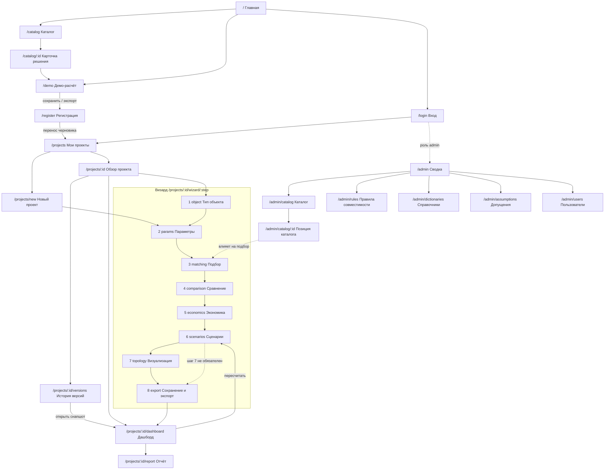

# Страничная архитектура фронтенда

Версия 0.1 (черновик, 19.09.2026). Владелец: Владимиров (фронтенд-визард).
Опирается на черновые контракты `contracts/*.md` — при их переделке
сверять колонку «Данные».

Сквозные НФТ, влияющие на все экраны:
- интерфейс полностью на русском, без англицизмов в подписях;
- понятен без инструкции: у каждого числового поля единица измерения,
  у каждого неочевидного — подсказка, у каждого результата — расшифровка;
- рабочее разрешение **от 1366×768**: критичный контент каждого экрана
  помещается в 1366×768 без горизонтальной прокрутки; вертикальная
  прокрутка допустима, но первый экран должен быть самодостаточным;
- долгие расчёты (до 60 с по ТЗ) — не блокирующий спиннер, а экран статуса
  с прогрессом и возможностью уйти на другую страницу.

---

## 1. Роли и зоны доступа

| Роль | Кто это | Что доступно |
|---|---|---|
| **Гость** | не аутентифицирован | публичная зона + демо-расчёт без сохранения |
| **Пользователь** | зарегистрирован | всё публичное + свои проекты, визард, дашборд, экспорт |
| **Админ** | сотрудник, ведущий каталог | всё пользовательское + админ-зона |

Правила видимости:
- гость **никогда** не видит `/projects/*` и `/admin/*` — редирект на `/login`
  с параметром `?next=` (после входа возвращаем на запрошенный экран);
- пользователь при попытке зайти в `/admin/*` получает `/403`, а не редирект
  на вход — он уже вошёл, проблема в правах;
- проекты изолированы по `ProjectRecord.owner_user_id`: чужой `id` → `/404`,
  а не `/403` (не раскрываем факт существования чужого проекта).

---

## 2. Полная карта маршрутов

### 2.1. Публичная зона (видна всем, включая вошедших)

| Маршрут | Экран | Доступ | Назначение | Данные |
|---|---|---|---|---|
| `/` | Главная | все | Что считает сервис, 3 шага «как это работает», CTA «Рассчитать бесплатно» / «Войти» | — |
| `/catalog` | Каталог решений | все | Таблица/карточки решений, фильтры: тип решения, отрасль, грузоподъёмность, навигация, доступность, производитель | `CatalogItem` (список) |
| `/catalog/:itemId` | Карточка решения | все | Все группы полей позиции + «Подобрать под мой объект» | `CatalogItem` |
| `/demo` | Демо-расчёт | гость | Визард в гостевом режиме (см. §4) | in-memory / sessionStorage |
| `/login` | Вход | гость | E-mail + пароль, ссылка на регистрацию | — |
| `/register` | Регистрация | гость | Регистрация + перенос демо-расчёта в аккаунт | — |
| `/forgot-password` | Восстановление пароля | гость | Отправка ссылки на e-mail | — |
| `/403`, `/404` | Ошибки доступа | все | Понятное объяснение + куда идти дальше | — |

### 2.2. Личный кабинет (только пользователь)

| Маршрут | Экран | Назначение | Данные |
|---|---|---|---|
| `/projects` | Мои проекты | Список проектов: название, тип объекта, статус, дата изменения, лучший срок окупаемости. Поиск, фильтр по статусу/типу, сортировка. Действия: открыть, копировать, переименовать, архивировать, удалить | `ProjectRecord[]` |
| `/projects/new` | Новый проект | Минимальная форма: название + тип объекта → сразу шаг 2 визарда | `ProjectRecord` (создание) |
| `/projects/:id` | Обзор проекта | Хаб проекта: статус, прогресс по шагам, краткие KPI, версии, кнопки «Продолжить визард» / «Открыть дашборд» | `ProjectRecord` |
| `/projects/:id/versions` | История версий | Список `ProjectVersion`: номер, дата, чем отличается. Открытие снапшота только для чтения, «Сделать текущей» (копией) | `ProjectVersion[]` |
| `/projects/:id/wizard/:step` | Визард, 8 шагов | См. §3 | см. §3 |
| `/projects/:id/dashboard` | Итоговый дашборд | Сравнение сценариев, чувствительность, допущения, экспорт. **Макет: [dashboard-scenarios.md](../wireframes/dashboard-scenarios.md)** | `EconomicsResult[]` |
| `/projects/:id/report` | Предпросмотр отчёта | Печатная вёрстка того, что уйдёт в PDF | `ProjectVersion` |
| `/profile` | Профиль | Имя, e-mail, смена пароля, организация | — |

### 2.3. Админ-зона (только админ)

| Маршрут | Экран | Назначение | Данные |
|---|---|---|---|
| `/admin` | Сводка | Позиций в каталоге, из них `unverified`, правил совместимости, устаревших записей (`last_updated` старше N мес.), пользователей | агрегаты |
| `/admin/catalog` | Каталог: управление | Таблица со всеми полями, массовые действия, импорт CSV/Excel, экспорт, фильтр по `confidence` и `availability_status` | `CatalogItem[]` |
| `/admin/catalog/new`, `/admin/catalog/:id` | Карточка позиции | Форма по группам: идентификация / технические / инфраструктура / экономика / применимость / качество данных | `CatalogItem` |
| `/admin/rules` | Правила совместимости | Плоская таблица правил: условие по оборудованию, условие по объекту, вердикт, причина, источник. Проверка правила на тестовой паре | `CompatibilityRule[]` |
| `/admin/dictionaries` | Справочники | Типы решений, процессы, зоны, режимы работы, ограничения планировки, единицы измерения | справочники |
| `/admin/assumptions` | Допущения расчёта | Дефолты экономики: тариф электроэнергии, ставка кредита, резерв CAPEX, горизонт TCO, наборы для чувствительности | дефолты `EconInput` |
| `/admin/users` | Пользователи | Список, роли, блокировка | — |

---

## 3. Визард: 8 шагов

Маршрут `/projects/:id/wizard/:step`, где `step` — слаг (не номер), чтобы
порядок можно было менять без ломки ссылок.

| # | Слаг | Экран | Что делает пользователь | Вход | Выход |
|---|---|---|---|---|---|
| 1 | `object` | Выбор типа объекта | Три крупные карточки: склад / аэропорт / медучреждение. Под каждой — что считаем и какие данные понадобятся | — | `ProjectInput.object_type` |
| 2 | `params` | Ввод параметров объекта | Форма под выбранный тип: валидация, единицы измерения, подсказки, импорт из Excel/CSV. **Макет: [02-object-params.md](../wireframes/02-object-params.md)** | `object_type` | `ProjectInput.params` |
| 3 | `matching` | Подбор оборудования | Смотрит ранжированный список кандидатов, раскрывает «почему так» (факторы и веса), отсеивает лишнее, добавляет вручную | `ProjectInput` | `MatchResult.candidates` |
| 4 | `comparison` | Сравнение решений | Отмечает 2–4 кандидата, сравнивает по ТТХ бок о бок, задаёт количество единиц, фиксирует состав | `MatchResult` | `selected_equipment[]` |
| 5 | `economics` | Экономика | Задаёт часы работы в год, загрузку, стоимость персонала, горизонт; видит CAPEX/OPEX/эффект/окупаемость/ROI/TCO по одному сценарию | `ScenarioInput` | `EconomicsResult` (baseline + основной) |
| 6 | `scenarios` | Сценарии и what-if | Добавляет сценарии (покупка / RaaS / кредит / свой), крутит допущения, смотрит чувствительность (мин. 3 параметра) | `ScenarioInput[]` | `EconomicsResult[]` (мин. 3) |
| 7 | `topology` | Визуализация | Рисует зоны/маршруты/точки на 2D-плане, расставляет роботов, запускает симуляцию, смотрит 3D и KPI загрузки | `TopologyConfig` | `TopologyConfig`, `SimulationTimeline` |
| 8 | `export` | Сохранение и экспорт | Проверяет сводку, сохраняет версию, выгружает PDF/Excel, уходит на дашборд | всё выше | `ProjectVersion`, файлы |

Правила навигации внутри визарда:
- **степпер вверху кликабелен назад** — на любой пройденный шаг можно
  вернуться в один клик; вперёд «через голову» нельзя, пока шаг не пройден;
- шаги 1–2 обязательны, 3–6 обязательны для дашборда, **шаг 7 не блокирует
  шаг 8** — визуализация полезная, но не обязательная для экономики;
- возврат на шаг 2 и изменение параметров помечает результаты шагов 3–6 как
  устаревшие (плашка «параметры изменились, подбор надо пересчитать»), но
  **не удаляет их** — пользователь сам решает, пересчитывать ли;
- черновик автосохраняется на каждом шаге; в шапке — время автосохранения;
- уход со страницы с несохранёнными изменениями — подтверждение;
- шаги 3, 6, 7 могут считаться долго → экран статуса с прогрессом, кнопкой
  «свернуть» и уведомлением по готовности.

---

## 4. Гостевой режим: что урезаем

`/demo` — тот же визард, но:

| Возможность | Гость | Пользователь |
|---|---|---|
| Шаги 1–5 (объект → экономика) | да | да |
| Шаг 6: несколько сценариев | **только 1 сценарий** | мин. 3 |
| Шаг 7: 2D/3D и симуляция | **нет** (заглушка с примером) | да |
| Шаг 8: сохранение | **нет** | да |
| Экспорт PDF/Excel | **нет** | да |
| Сохранение между сессиями | нет (sessionStorage) | да |

На каждом заблокированном месте — не серая кнопка молча, а объяснение:
«Чтобы сохранить расчёт и сравнить сценарии, зарегистрируйтесь — данные,
которые вы уже ввели, перенесутся в проект».

**Перенос демо в аккаунт.** Черновик гостя лежит в sessionStorage. После
`/register` или `/login` из демо — предлагаем «Перенести демо-расчёт в новый
проект?». Это решение к согласованию с backend-glue: нужна ручка «создать
проект из клиентского черновика».

---

## 5. Граф переходов

---

## 6. Общие элементы навигации

**Шапка (везде, 56 px).** Слева логотип → `/`, «Каталог», для вошедшего —
«Мои проекты», для админа — «Администрирование». Справа: гость — «Войти» /
«Регистрация»; пользователь — имя и меню (профиль, выход).

**Контекстная шапка проекта (внутри `/projects/:id/*`, 48 px).** Название
проекта (редактируется по клику), статус (`черновик` / `рассчитан` /
`в архиве`), время автосохранения, кнопки «Дашборд» и «Версии».

**Степпер визарда (48 px).** 8 шагов с состояниями: пройден / текущий /
доступен / заблокирован / требует пересчёта.

**Нижняя панель визарда (64 px, зафиксирована).** Слева «Назад», справа
«Сохранить черновик» и «Далее». Кнопка «Далее» неактивна с подписью-причиной,
а не молча.

Итого постоянная обвязка на шагах визарда: 56 + 48 + 48 + 64 = **216 px**,
значит при высоте окна 768 px на рабочую область остаётся **552 px** — под
это и рисуются макеты.

---

## 7. Открытые вопросы

1. Перенос гостевого черновика в аккаунт — нужна ручка на бэкенде (см. §4).
2. Публичный каталог: показываем ли гостю цены из `EconomicsInfo` или прячем
   под «по запросу»? Влияет на ценность демо-расчёта.
3. Роль «админ» — отдельная сущность или флаг у пользователя? Влияет только
   на `/admin/users`, но решать до auth.
4. Экспорт PDF: серверный рендер или печать страницы `/projects/:id/report`
   из браузера. Второе дешевле, но хуже управляемо.
5. Устаревание результатов: нужна ли пометка «рассчитано на каталоге от
   <дата>», раз каталог админ меняет, а снапшоты версий — нет.
